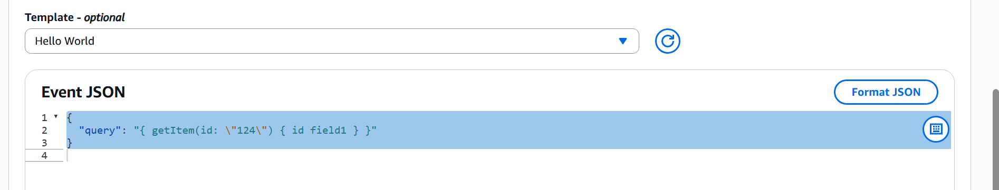
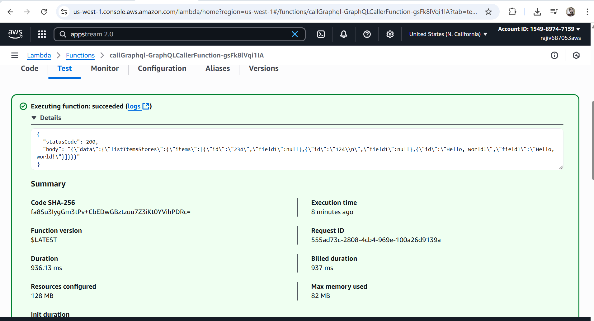
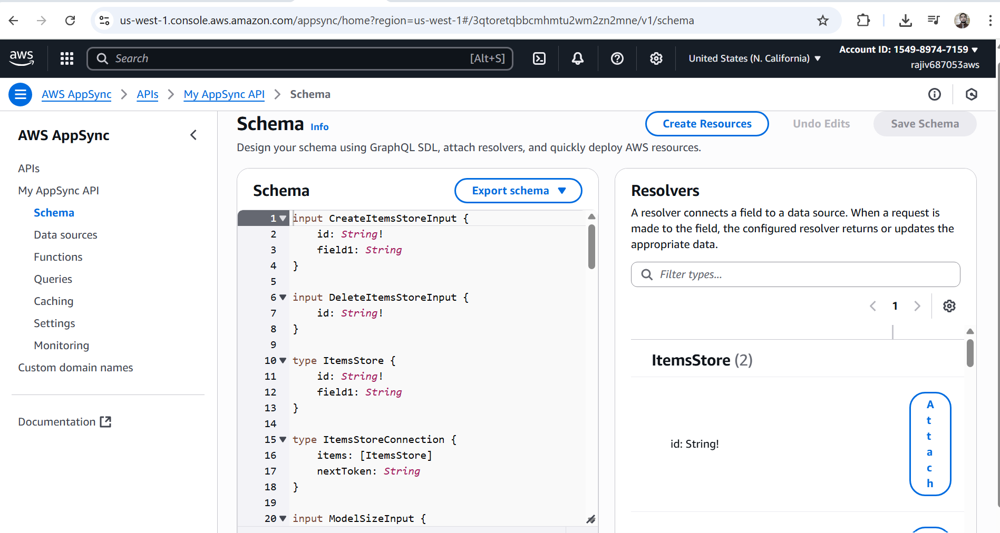

# AWS SAM Lambda - GraphQL Caller

This project contains an AWS Lambda function (Node.js 20) that calls an AWS AppSync GraphQL API using the **AWS SAM (Serverless Application Model)** framework.

## 📂 Project Structure

```
.
├── assets/
├── src/
│   └── graphqlCaller.ts    # Lambda source (TypeScript)
├── template.yaml           # SAM template for deployment
└── README.md               # This file
```

The build output after running `sam build` is placed in the `.aws-sam/build` directory.

## 🚀 Prerequisites

- [AWS CLI](https://docs.aws.amazon.com/cli/latest/userguide/getting-started-install.html)
- [AWS SAM CLI](https://docs.aws.amazon.com/serverless-application-model/latest/developerguide/install-sam-cli.html)
- Node.js 20+ and npm
- esbuild (required for SAM build)
  ```bash
  npm install --save-dev esbuild
  ```

## ⚙️ Setup

1. Install dependencies:
   ```bash
   npm install
   ```

2. Build the project:
   ```bash
   sam build
   ```

3. Deploy to AWS:
   ```bash
   sam deploy --guided
   ```

   During guided deploy, provide:
   - Stack name (e.g. `callGraphql`)
   - AWS region
   - IAM permissions

## 🧪 Testing the Lambda
Event JSON :


OutPut :

```bash
aws lambda invoke   --function-name <DeployedLambdaName>   response.json
cat response.json
```

## 🔑 Environment Variables

The Lambda expects the following environment variable:

- `GRAPHQL_API_URL` → Your AppSync GraphQL endpoint URL.

GraphQL details:


## 📌 Notes

- Ensure your GraphQL query in `graphqlCaller.ts` matches your AppSync **schema**.

- query:
  ```graphql
  query listItemsStores {
  listItemsStores {
    items {
      id
      field1
    }
  }
}
```

